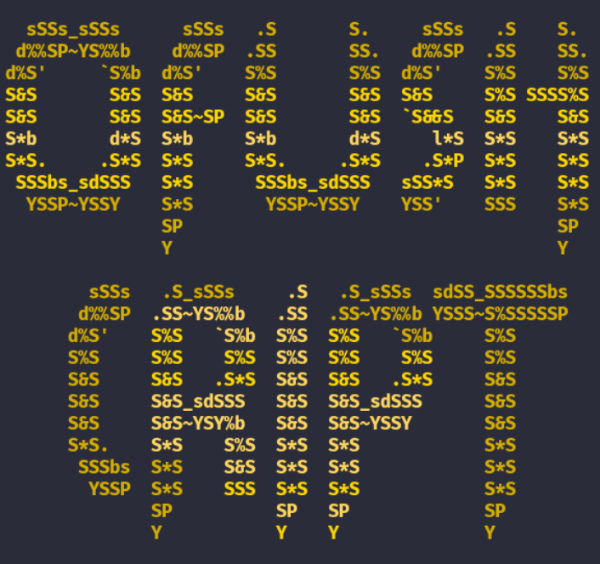

<h1 align="center">OFUSH-CRIPT</h1>

Este script fue diseñado para proteger los códigos de los programadores,  para asi evitar copias falsas por los <b>SCRIPT-CODE-RATS</b>.

 

## primero actualizamos los paquetes
    apt update && apt upgrade -y

## instalamos git
    pkg install git  
## instalamos python y python3
    pkg install python
    
    pkg install python3
## instalamos alive-progress
    pip install alive-progress
## instalamos setuptools
    pip install setuptools
## repositorio
    git clone https://github.com/STE4LPH/OFUSH-CRIPT.git

## Navega al directorio:
    cd COFUSH-CRIPT
    
## Ejecutar el script:
    python ofush_cript.py

## *Una vez ya creado la carpeta*

## Navega al nombre del directorio:
    cd ~/nombre_de_la_carpeta

## Navega al directorio
    cd package
## Listamos
    ls 
## Editas el archivo que se a creado y pones el código que quieres ofuscar
    nano nombre_código_original.py
## Volvemos al directorio anterior 
    cd ..
## Ejecutamos
    python3 compile.py build_ext --inplace

# *Listo ya lo tienes ofuscado*

# Borrar (IMPORTANTE)

## borras los archivos inecesarios
    rm -rf compile.py build main.c

## Navegas al directorio 
cd package

# borras tu código original 
rm -rf tu_codigo_orignal.py tu_coidgo.c 

<b> *ESO ES TODO, me dio tanta paja crear la descripción*</b>

